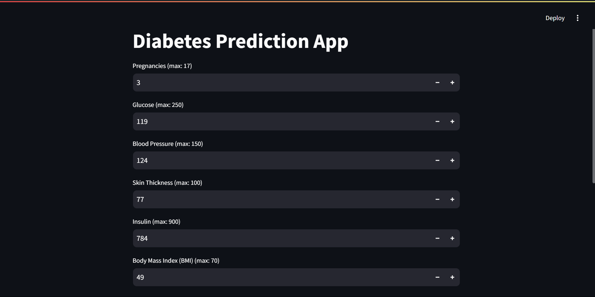

# Diabetes Prediction

This is a web application that predicts the likelihood of diabetes based on user-provided health metrics. The prediction is powered by a Decision Tree Classifier model trained on the dataset from the N. Inst. of Diabetes & Diges. & Kidney Dis.

## Table of Contents

- [Features](#features)
- [Installation](#installation)
- [Usage](#usage)
- [Input Features](#input-features)
- [Model](#model)
- [Screenshots](#screenshots)
- [Contributing](#contributing)
- [License](#license)

## Features

- **User-Friendly Interface**: Simple and intuitive web interface using Streamlit.
- **Real-Time Predictions**: Provides instant predictions based on user inputs.
- **Decision Tree Classifier**: The app uses a trained Decision Tree model to make predictions.

## Installation

Follow these steps to set up and run the application locally:

1. **Clone the Repository:**

    ```bash
    git clone https://github.com/coffee-and-debugging/Diabetes_Prediction_System-Decision_Tree_Implementation.git
    cd diabetes-prediction-app
    ```

2. **Create and Activate a Virtual Environment:**

    ```bash
    python -m venv venv
    venv\Scripts\activate
    ```

3. **Install Dependencies:**

    ```bash
    pip install -r requirements.txt
    ```

4. **Run the Application:**

    ```bash
    streamlit run main.py
    ```

## Usage

1. After running the application, open your web browser and go to the URL provided by Streamlit (usually `http://localhost:8501`).
2. Enter the required health metrics in the input fields provided.
3. Click the **Predict** button to see the prediction result (either "Diabetes" or "No Diabetes").

## Input Features

The app takes the following input features to make predictions:

- **Pregnancies**: Number of times pregnant.
- **Glucose**: Plasma glucose concentration a 2 hours in an oral glucose tolerance test.
- **Blood Pressure**: Diastolic blood pressure (mm Hg).
- **Skin Thickness**: Triceps skin fold thickness (mm).
- **Insulin**: 2-Hour serum insulin (mu U/ml).
- **BMI**: Body Mass Index (weight in kg/(height in m)^2).
- **Diabetes Pedigree Function**: A function that scores the likelihood of diabetes based on family history.
- **Age**: Age of the user in years.

## Model

The prediction model is a Decision Tree Classifier trained on the dataset from the N. Inst. of Diabetes & Diges. & Kidney Dis. The model was saved using the `pickle` library as `diabetes_prediction_model.pkl`.

### Training Process

- The model was trained on the following features:
  - `Pregnancies`
  - `Glucose`
  - `BloodPressure`
  - `SkinThickness`
  - `Insulin`
  - `BMI`
  - `DiabetesPedigreeFunction`
  - `Age`

## Screenshots

Here’s how the application looks:



## Contributing

Contributions are welcome! If you'd like to contribute, please fork the repository and create a pull request with your changes. Make sure your code is well-documented and adheres to the project's coding standards.

## License

This project is licensed under the MIT License. See the [LICENSE](LICENSE) file for details.